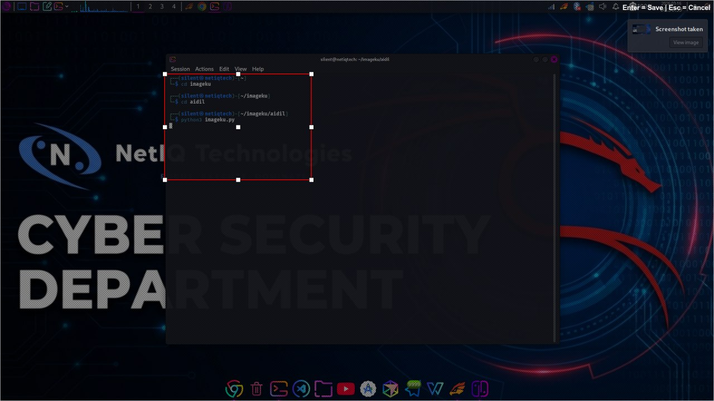
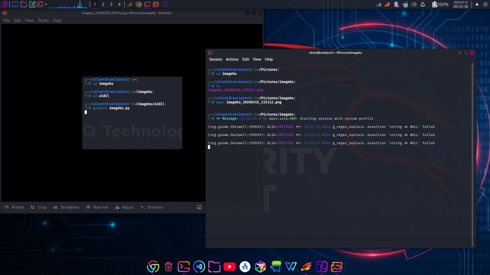

# Imageku 🖼️

[](https://www.python.org/)
[](LICENSE)

**Imageku** is a lightweight **Python screenshot snipping tool**, similar to the Windows Snipping Tool.  
Press **Print Screen** to capture your screen and select the area you want to save.  
The tool allows you to **draw, move, and resize the selection box** before saving.

---

## Features

- Capture screenshots with **Print Screen key**
- **Fullscreen snipping overlay**
- **Drag to select capture area**
- **Move and resize selection box**
- **8 resize handles** (corners + edges)
- Save screenshot with **timestamp filename**
- Automatically saved to:

```
~/Pictures/imageku/
```

- Cross-platform support (Windows & Linux)
- Lightweight **GUI overlay** using Tkinter

---

## Demo

### Select Screenshot Area


### Resize or Move Selection


---

## How It Works

1. Press **Print Screen**
2. Fullscreen screenshot overlay appears
3. **Drag your mouse** to select the capture area
4. Adjust the selection:
   - Drag edges/corners to resize
   - Drag center to move
5. Press **Enter** to save the screenshot
6. Press **Esc** to cancel

---

## Controls

| Key | Action |
|-----|--------|
| `Print Screen` | Start screen capture |
| `Enter` | Save screenshot |
| `Esc` | Cancel snipping |

---

## Requirements

- Python 3.9+
- Dependencies:

```bash
pip3 install pillow pynput
```

**Linux-specific dependencies** (for ImageGrab support):

```bash
sudo apt install python3-tk scrot    # Ubuntu/Debian/Kali
sudo pacman -S tk scrot              # Arch Linux
sudo dnf install python3-tkinter scrot # Fedora
```

---

## Run

```bash
python3 imageku.py
```

---

## Better Performance & Autostart

For **faster response**, run Imageku automatically at system startup.  
This ensures the keyboard listener is active in the background.

### Linux (Kali / GNOME / XFCE / KDE)

1. Copy `imageku.py` to **root directory**:

```bash
sudo cp imageku.py /usr/share/kali-themes/imageku.py
sudo chmod +x /usr/share/kali-themes/imageku.py
```

2. Open **Keyboard → Application Shortcuts**
3. Click **Add** or **+**
4. Set the command to:

```
/usr/share/kali-themes/imageku.py
```

5. Assign a trigger (optional: “On login”)
6. Save

The program will now run automatically at login and listen for **Print Screen** key presses.

### Windows

1. Press `Win + R` and type:

```bash
shell:startup
```

2. Place a shortcut to `imageku.py` in the folder
3. Optional: rename to `imageku.pyw` to hide the console window

---

## Project Structure

```
project/
│
├─ imageku.py
├─ README.md
└─ images/
   ├─ 1.jpg
   ├─ 2.jpg
   └─ saved.png
```

---

## Screenshot Naming

Saved screenshots follow this format:

```
imageku_YYYYMMDD_HHMMSS.png
```

Example:

```
imageku_20260315_142530.png
```

---

## Built With

- **Tkinter** – GUI overlay
- **Pillow (PIL)** – Image processing
- **pynput** – Keyboard listener
- **ImageGrab** – Screen capture

---

## License

MIT License
